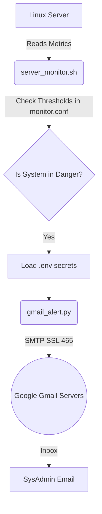

# 🚀 Server Alert Manager (Gmail Integration)

نظام متكامل وخفيف (Lightweight) لمراقبة موارد خوادم لينكس (Linux Servers) وإرسال تنبيهات فورية عبر البريد الإلكتروني (Gmail) عند تجاوز الموارد للحدود المسموحة.

---

## 🎯 الهدف من المشروع (Objective)
مراقبة مساحة القرص (Disk Space) والذاكرة العشوائية (RAM) بشكل دوري (عبر `Crontab`)، وتنبيه مدير النظام (SysAdmin) أوتوماتيكياً في حالة الخطر.

---

## 🧠 الفكرة المعمارية (Architecture & Separation of Concerns)

بدلاً من كتابة كود واحد معقد، تم تقسيم المشروع إلى جزأين لضمان سهولة الصيانة والأمان:

1. **المُراقب (Bash Script):** 
   - مسؤول عن التفاعل مع نظام التشغيل بأوامر خفيفة (`df`, `free`, `awk`).
   - يقرأ إعدادات المراقبة من ملف `monitor.conf`.
2. **المُرسل (Python Script):**
   - مسؤول عن الشبكات وإرسال الإيميلات.
   - يتصل بخوادم جوجل باستخدام بروتوكول `SMTP` المشفر `SSL` على بورت `465`.
   - يقرأ البيانات السرية من ملف مخفي `.env` لضمان الأمان.

---

## ⚖️ القرارات التقنية (Technical Decisions & Alternatives)

أثناء بناء هذا النظام، تم دراسة عدة بدائل واختيار الأنسب بناءً على الـ Best Practices:

### 1. لماذا لم نستخدم `Postfix` أو `Sendmail` (أدوات Bash القياسية)؟
- **المشكلة:** تنصيب `Postfix` ليعمل كـ (Mail Transfer Agent) يستهلك موارد السيرفر، ويحتاج لإعدادات أمنية معقدة (SPF, DKIM, DMARC) لكي لا تصل الرسائل إلى مجلد الـ Spam. وأي خطأ في الإعدادات قد يحول السيرفر إلى (Open Relay Vulnerability).
- **الحل:** استخدمنا `Python smtplib` لأنه يعمل كـ (Client) يتصل بخوادم جوجل الموثوقة مباشرة، مما يضمن وصول الإيميل לـ Inbox بأمان تام وبدون أي تعديل في جدار حماية السيرفر.

### 2. لماذا استخدمنا ملف `.env` و `monitor.conf`؟
- **Security:** وضع كلمات المرور داخل الكود (Hardcoding) يعتبر ثغرة أمنية. تم عزلها في `.env` (Ignored by Git).
- **Maintainability:** وضعنا نسب المراقبة (مثل 80% للديسك) في `monitor.conf` ليتمكن أي شخص من تعديل النسب دون المساس بالكود البرمجي (تنفيذاً لمبدأ 12-Factor App).

### 3. لماذا استخدمنا `App Passwords` من جوجل؟
لأن جوجل أوقفت الـ (Basic Authentication) للتطبيقات الخارجية. استخدام App Password يمنح السكريبت صلاحية إرسال إيميلات فقط، دون القدرة على قراءة الرسائل، ويمكن إلغاؤه في أي وقت.

---

## 📚 المصادر الرسمية (References)

تم الاعتماد بالكامل على التوثيقات الرسمية (Official Documentation) لضمان كتابة كود قياسي (Standard Code):

1. **[Python 3 Official Docs (smtplib)](https://docs.python.org/3/library/smtplib.html)**: 
   - لإنشاء اتصال `SMTP_SSL` آمن.
2. **[Google Workspace Admin Help (App Passwords)](https://support.google.com/accounts/answer/185833?hl=en)**: 
   - لتأمين الحساب واستخراج كلمة مرور مخصصة للتطبيق.
3. **[Corey Schafer: Send Emails Using Python (YouTube)](https://www.youtube.com/watch?v=JdzkVbk-e-4)**: 
   - مرجع عملي ممتاز لطريقة استخدام كلاس `EmailMessage` لصياغة الـ Headers بشكل صحيح.
4. **[GNU Awk User's Guide](https://www.gnu.org/software/gawk/manual/gawk.html)**: 
   - لاستخراج الأرقام من أوامر اللينكس (`df` و `free`) بأقل استهلاك للمعالج.

---
*تم تطوير هذا المشروع كجزء من مهام إدارة الخوادم (System Administration) 🛠️*
