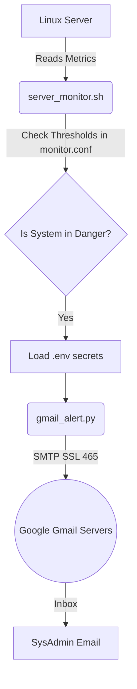

# 🚀 Server Alert Manager (Gmail Integration)

A fully integrated, lightweight system for monitoring Linux server resources and sending instant, automated alerts via email (Gmail) when resources exceed allowed thresholds.

---

## 🎯 Project Objective
To monitor Disk Space and RAM usage periodically (via `Crontab`) and automatically notify the System Administrator in case of critical resource consumption.

---

## 🧠 System Architecture & Separation of Concerns

Instead of writing a single complex script, the project is divided into two parts to ensure maintainability and security:

1. **The Monitor (Bash Script):** 
   - Responsible for interacting with the OS using lightweight commands (`df`, `free`, `awk`).
   - Reads monitoring thresholds from a `monitor.conf` file.
2. **The Sender (Python Script):**
   - Handles networking and email delivery.
   - Connects to Google's servers using the secure `SMTP_SSL` protocol on port `465`.
   - Reads sensitive credentials from a hidden `.env` file to ensure maximum security.

---

## ⚖️ Technical Decisions & Alternatives

During the development of this system, several alternatives were evaluated and rejected based on DevOps Best Practices:

### 1. Why didn't we use `Postfix` or `Sendmail` (Standard Bash MTAs)?
- **The Problem:** Installing `Postfix` to act as a Mail Transfer Agent consumes server resources and requires complex security configurations (SPF, DKIM, DMARC) to prevent emails from going to the Spam folder. Any misconfiguration could turn the server into an Open Relay Vulnerability.
- **The Solution:** We used `Python smtplib` because it acts as a client that connects directly to trusted Google servers, guaranteeing that the email reaches the Inbox securely without modifying the server's firewall.

### 2. Why use `.env` and `monitor.conf`?
- **Security:** Hardcoding passwords inside the source code is a major security vulnerability. They were isolated in a `.env` file (which is ignored by Git).
- **Maintainability:** We placed the monitoring limits (e.g., 80% Disk usage) in `monitor.conf` so anyone can modify the thresholds without altering the core logic (following the 12-Factor App methodology).

### 3. Why use Google's `App Passwords`?
Google has disabled Basic Authentication for third-party apps. Using an App Password grants the script permission to send emails only, without the ability to read them, and it can be revoked at any time.

---

## 📚 Official References

This system was built entirely relying on official documentation to ensure standard and secure code:

1. **[Python 3 Official Docs (smtplib)](https://docs.python.org/3/library/smtplib.html)**: For creating a secure `SMTP_SSL` connection.
2. **[Google Workspace Admin Help (App Passwords)](https://support.google.com/accounts/answer/185833?hl=en)**: For account security and app password generation.
3. **[Corey Schafer: Send Emails Using Python (YouTube)](https://www.youtube.com/watch?v=JdzkVbk-e-4)**: Excellent practical reference for using the `EmailMessage` class to format headers properly.
4. **[GNU Awk User's Guide](https://www.gnu.org/software/gawk/manual/gawk.html)**: For extracting numbers from Linux commands (`df` and `free`) with zero CPU overhead.
